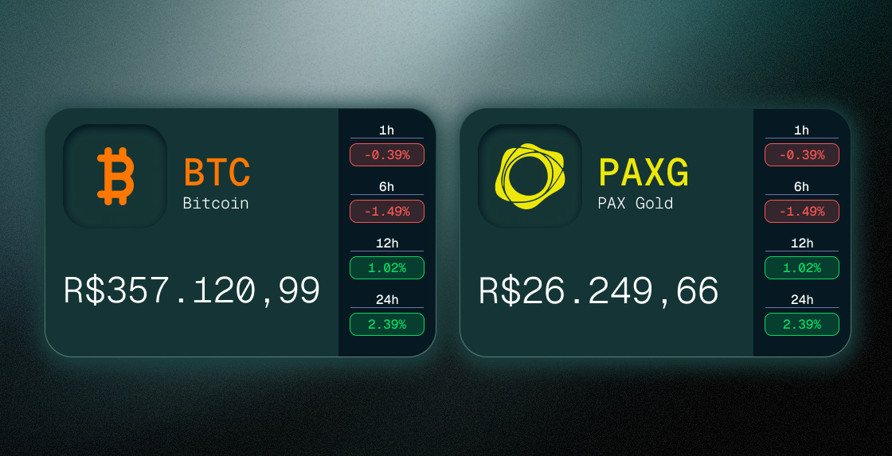
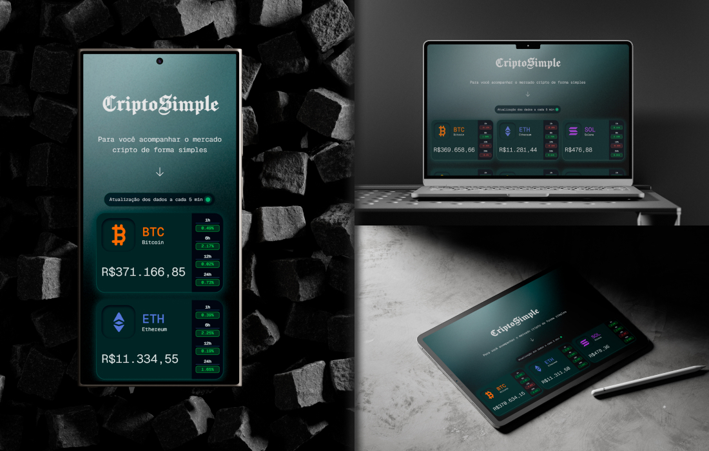

<div align="center">
  


  </div>

## :white_check_mark: Tópicos
* [Descrição do Projeto](#file_folder-descrição-do-projeto);
* [Estrutura do Projeto](#card_index_dividers-estrutura-do-projeto);
* [Aplicação da API](#gear-aplicação-da-api);
* [Demonstração e Protótipo](#computer-demonstração-e-protótipo);
* [Tecnologias Utilizadas](#hammer-tecnologias-utilizadas);
* [Acessar o Projeto](#link-acessar-o-projeto).

## :file_folder: Descrição do Projeto
O **CriptoSimple** é um dashboard minimalista focado na **Experiência do Usuário (UX)**, desenvolvido para resolver a sobrecarga de informações comum no mercado de criptomoedas. A aplicação filtra o ruído visual de exchanges complexas e entrega apenas os dados essenciais para uma consulta rápida: **Nome, Símbolo, Preço (em BRL) e Variações Percentuais.**

O projeto foi realizado usando `React v19.2.0` e `Tailwind CSS v4.2.1` como frameworks principais, ambos instalados por meio do `Vite v7.3.1`. Além de ter sido utilizado `Figma MCP` para acelerar o fluxo de desenvolvimento (Design-to-Code), garantindo que o componente de Card seguisse rigorosamente as especificações visuais do protótipo.

Para a requisição das informações de cada criptomoeda foi utilizada a **:hot_pepper:CoinPaprika API** - voltada para disponibilizar em tempo real **preços, volume, market cap** e muito mais de milhares de criptomoedas.

## :card_index_dividers: Estrutura do Projeto
- `src/components`: Componentes reutilizáveis (Card, Header, etc).
- `src/services`: Lógica de consumo de APIs.
- `src/services/api.js`: Consumo da CoinPaprika API.
- `src/services/mock.js`: Consumo de um mock provisório caso a API não funcione.
- `src/assets`: Imagens e estilos globais.
- `.gitignore`: Arquivos e pastas a não serem enviados/rastreados ao repositário remoto, evitando de vazar arquivos sensíveis (`.vscode`) ou de carregar dependências pesadas (`node_modules`).
- `SKILL.md`: Usado pela IA na conversão de designs complexos em componentes funcionais utilizando `React` e `Tailwind CSS`, com foco em fidelidade visual absoluta (espaçamentos, tipografia e cores).


## :gear: Aplicação da API

A integração com a [:hot_pepper:Coinpaprika API](https://docs.coinpaprika.com/) foi desenvolvida com foco em performance e resiliência, utilizando o método `GET` para monitorizar dados em tempo real.

### :hammer_and_wrench: Estratégia de Implementação

Como a aplicação precisa de dados de múltiplas criptomoedas simultaneamente, a implementação segue estes pilares:

1. **Processamento Paralelo com `Promise.allSettled`**: 
   Em vez de carregar uma moeda de cada vez, o código dispara todas as requisições simultaneamente. Utilizamos o `allSettled` para garantir que, mesmo que a requisição de uma moeda falhe (erro 404 ou limite atingido), as outras continuem a ser processadas.

2. **Normalização de Dados**:
   Os dados brutos são filtrados e mapeados para um objeto `finalData`. Realizamos ajustes de chaves (ex: converter `TRX` para `tron`) para manter a consistência com a estrutura interna do projeto.

3. **Localização e UX (User Experience)**:
   * **Moeda**: As requisições utilizam o parâmetro `?quotes=BRL` para obter preços em Reais.
   * **Feedback Dinâmico**: O preço do Bitcoin (BTC) é formatado via `toLocaleString` e injetado no título da aba (`document.title`), permitindo o acompanhamento sem mudar de janela.

### :bar_chart: Moedas Monitorizadas

Abaixo estão os IDs utilizados para as requisições:

<div align="center">

| Id Correspondente |
| :--- | 
| btc-bitcoin |
| eth-ethereum |
| sol-solana |
| bnb-binance-coin |
| paxg-pax-gold |
| hype-hyperliquid |
| sui-sui |
| zec-zcash |
| xmr-monero |
| xrp-xrp |
| trx-tron |
| link-chainlink |

</div>

### :warning: Limitações de Uso (Free Tier)
De acordo com a documentação oficial, a aplicação respeita os seguintes limites:
* **Frequência**: 1 requisição a cada 5 minutos por endpoint.
* **Volume**: Máximo de 20.000 requisições mensais.

### :memo: Estrutura de Resposta (JSON)
Extraímos apenas os campos essenciais: `name`, `symbol`, `price` e as variações de 1h, 6h, 12h e 24h. Exemplo de retorno esperado:

```json
{
  "id": "btc-bitcoin",
  "name": "Bitcoin",
  "symbol": "BTC",
  "quotes": {
    "BRL": {
      "price": 5162.15,
      "percent_change_1h": 0,
      "percent_change_6h": 0,
      "percent_change_12h": -0.09,
      "percent_change_24h": 1.59
    }
  }
}
```


## :computer: Demonstração e Protótipo

### Protótipo Card



O Card foi projetado para possuir uma barra lateral onde mostrasse as variações de porcentagem, caso a porcentagem presente fosse maior que zero, ela apareceria em verde, caso contrário, em vermelho.
A ideia foi implementada no código dessa forma:

```html
<div className="flex flex-col justify-center items-center">
        <div className=" text-[#FFFFFF] font-['Geist_Mono'] font-medium text-[16px] leading-[1.3] text-center">1h</div>
        <div className=" w-23 h-0 border-t border-[#6B74A3]"></div>
        <div className={`flex items-center justify-center w-23 h-6.75 mt-1.5 border rounded-[8px] ${percentage1 > 0 ? 'bg-[rgba(6,217,98,0.2)]  border-[#06D962]' : 'bg-[rgba(241,86,83,0.2)]  border-[#F15653]'}`}>
            <span className={ `w-14.5 h-5.25 font-['Geist_Mono'] font-medium text-[16px] leading-[1.3] text-center ${percentage1 > 0 ? 'text-[#06D962]' : 'text-[#F15653]'}`}>{percentage1}%</span>
        </div>
</div>
```
Na `<div>` onde engloba o `<span>` colequei um **operador ternário** para fazer essa distinção: se a porcentagem for maior que 0, borda e background verde, caso contrário, vermelho. Mesma coisa no `<span>`, mas apenas mudando a cor da fonte.

### Demonstração - Tipos de Tela



## :hammer: Tecnologias Utilizadas

<div align="left">
  
  
  
  
  
  
  
  
  
  
  
  
  
  
  
  
  
  
  
  
  
</div>

### Figma MCP

#### Definição
O `Figma MCP` é um padrão de código aberto criado para conectar o Figma a modelos de IA, permitindo que agentes de inteligência artificial "leiam" e entendam arquivos de design, componentes e variáveis em tempo real. Ele traduz designs visuais em código estruturado, facilitando a geração automática de componentes, layouts e estilos consistentes com o design original.

#### Como foi utilizado
Com o `.gitignore` não foi enviado ao repositório a pasta `.vscode` nem o arquivo `mcp.json` - responsável por configuar o `MCP Server` - para evitar vazamentos de dados sensíveis. De acordo com a documentação do [Figma-Context-MCP](https://github.com/GLips/Figma-Context-MCP.git), a configuração padrão do `mcp.json` deve ser assim para Windows - caso utlilize o **Cursor** como IDE de desenvolvimento:

```json
{
  "mcpServers": {
    "Framelink MCP for Figma": {
      "command": "cmd",
      "args": ["/c", "npx", "-y", "figma-developer-mcp", "--figma-api-key=YOUR-KEY", "--stdio"]
    }
  }
}
```

Como utilizei o **VsCode**, o código sofre uma leve mudança: ao invés de `"mcpServers"`, é colocado apenas `"servers"`.
```json
{
  "servers": {
    "Framelink MCP for Figma": {
      "command": "cmd",
      "args": ["/c", "npx", "-y", "figma-developer-mcp", "--figma-api-key=YOUR-KEY", "--stdio"]
    }
  }
}
```

Para que meu Figma fosse acessado pelo `MCP Server`, foi necessário colocar meu **Figma Token** no `"--figma-api-key=YOUR-KEY"`. Como dito anteriormente, o `.gitignore` foi utilizado exatamente para proteger dados sensíveis, um deles sendo o `mcp.json` que **contém** o token privado.

## :link: Acessar o Projeto

Acesse aqui a :point_right: [página](https://criptosimple.netlify.app/) :point_left: 


